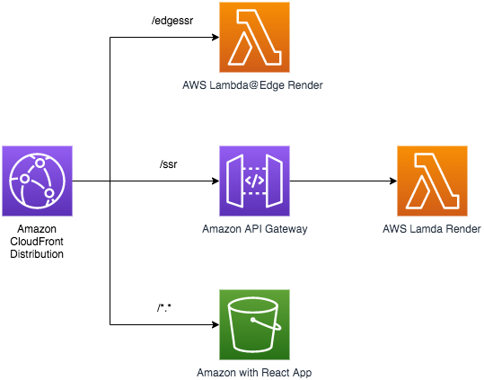

# Sample to deploy React SSR on Lambda

This repository consists of a sample to demonstrate two variants to do Server Side Rendering with AWS Lambda for React applications.
It usues AWS CDK to make the deployment.

This solution can only be provisioned in the us-east-1 Region as it deploys Lambda@Edge, which can only be done in that Region.

## Requirements
- Node.js 12.x
- AWS CDK 1.72+
- Configured aws credentials
- This example will only be deployed successfuly in us-east-1 region as it is using AWS Lambda@Edge

## Folder structure

- /cdk - code to deploy the solution 
- /simple-ssr - React application created with the create-react-app tool.

## Deployment
- Clone git repository

    `git clone https://github.com/aws-samples/react-ssr-lambda.git`

- Run the following commands in your terminal window, provide the name of the S3 bucket instead of `<your bucket name>`, for example `mybucket`, to deploy the static content

    `cd react-ssr-lambda`

    `cd ./cdk`

    `npm install`

    `npm run build`

    `cdk bootstrap`

    `cdk deploy SSRApiStack --outputs-file ../simple-ssr/src/config.json`

    `cd ../simple-ssr`

    `npm install`

    `npm run build-all`

    `cd ../cdk`

    `cdk deploy SSRAppStack --parameters mySiteBucketName=<your bucket name>`

- After successful deployment you will see output variables

    **CF URL** - for React App stored on S3 and rendered on client

    **Lambda SSR URL** - for React App rendered by Lambda behind API Gateway

    **Lambda@Edge SSR URL** - for React App rendered by Lambda@Edge

- To clean-up the reated resources run

    `cd ./cdk`

    `cdk destroy SSRApiStack`
    
    `cdk destroy SSRAppStack`
